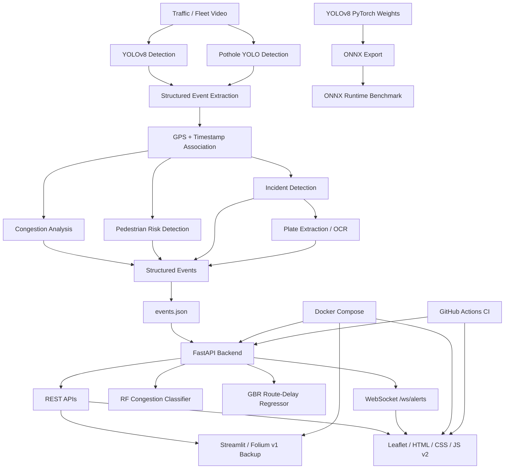

# TransitNexus

**AI-Powered Mobile Urban Intelligence Platform Using Public Transport Fleet**

TransitNexus is a prototype urban-intelligence platform designed to transform public-transport fleet video/data into structured mobility events and actionable insights.

The system combines computer vision, event processing, simulated GPS association, congestion analysis, pedestrian-risk detection, incident alerts, ML-based congestion and route-delay prediction, a FastAPI backend, WebSocket real-time alerts, and two dashboard frontends: a new Leaflet/HTML/CSS/JavaScript frontend and the original Streamlit prototype kept as a backup.

> **SIH 2026 Prototype — Software Category**
>
> This prototype uses pretrained models and simulated fleet/GPS data to demonstrate the core intelligence pipeline. Production deployment would integrate live fleet feeds, real GPS telemetry, improved ALPR/OCR, and scalable infrastructure.

---

## Problem Statement

Urban public-transport fleets continuously move through city roads and generate valuable visual and mobility data. However, converting this raw fleet data into structured information about traffic conditions, congestion, pedestrian risks, road incidents, and locations is challenging.

TransitNexus demonstrates an AI-powered pipeline that can process fleet video, detect relevant objects/events, associate events with location and time, and present the resulting intelligence through a GIS-based dashboard.

---

## Solution

TransitNexus provides an end-to-end prototype pipeline:

```text
Fleet / Traffic Video
        ↓
Computer Vision Detection
        ↓
Structured Event Extraction
        ↓
GPS + Timestamp Association
        ↓
Event Analytics
   ├── Congestion Analysis
   ├── Pedestrian Risk Detection
   └── Incident Detection
             ↓
      Plate Extraction / OCR
             ↓
      Structured Event Data
             ↓
        FastAPI Backend
        ├── REST APIs
        ├── RF Congestion Model
        ├── GBR Route-Delay Model
        └── WebSocket Alerts
             ├─────────────┐
             ↓               ↓
     Leaflet/JS v2       Streamlit v1
     Live Frontend       Backup Prototype
```

The dashboard provides a visual representation of detected events, congestion zones, analytics, and incident alerts.

### Live Deployments

**v2 — Leaflet/HTML/CSS/JavaScript + real-time WebSocket alerts**

https://transitnexus-frontend.onrender.com

The v2 frontend connects to the deployed FastAPI backend using HTTPS REST APIs and a secure WebSocket (`wss://`) channel for live incident alerts.

**v1 — Streamlit prototype / backup**

The original Streamlit dashboard remains available as a fallback while the new v2 frontend is used as the primary presentation interface.

> The Streamlit version is intentionally retained as a backup to preserve the working prototype while the newer frontend stack is evaluated.

---

## Key Features

### 1. Vehicle & Pedestrian Detection

* YOLOv8-based object detection.
* Detects vehicles and people from traffic/fleet video.
* Stores detection confidence and evidence frames.

### 2. Structured Urban Events

Each processed event can contain:

* Event type
* Detection confidence
* Latitude
* Longitude
* Timestamp
* Evidence frame path

This converts raw computer-vision output into structured mobility data.

### 3. GPS Association

The current prototype simulates GPS movement along the:

**Kopargaon MSRTC Bus Stand → Kopargaon Railway Station**

route.

GPS coordinates are interpolated along predefined route points and associated with video timestamps.

> Production version: integrate real-time GPS telemetry from public-transport vehicles.

### 4. Congestion Analysis

Vehicle detections are aggregated into 5-second windows.

The prototype calculates a **vehicle detection-density score** to identify potentially congested periods.

This is a detection-density metric for the prototype and should not be interpreted as a direct measurement of physical traffic density.

### 5. Pedestrian Risk Detection

A predefined high-risk roadside zone is used to identify detected persons entering the zone.

This demonstrates how fleet video can be used to flag potential pedestrian-risk locations.

### 6. Incident Detection

The prototype includes an incident workflow that:

* Selects vehicle evidence frames.
* Associates the event with timestamp and GPS.
* Extracts/associates a plate value.
* Stores supporting frames.
* Displays the incident in the dashboard's **Live Alerts** panel.

### 7. Plate Extraction / OCR

The prototype attempts OCR-based plate extraction using **EasyOCR**.

For the current demonstration, OCR output was too noisy to reliably identify a real license plate. Therefore, the demonstrated incident uses:

```text
plate: MH15-TRN-01
plate_source: mock_ocr
plate_confidence: 0.85
```

**OCR accuracy to be improved in Phase 2.**

Planned improvements include:

* Better license-plate region localization
* Image preprocessing
* Multi-frame OCR aggregation
* Improved OCR/ALPR models
* Production-grade validation

### 8. GIS Dashboards

TransitNexus currently provides two frontend implementations.

**v2 — Leaflet/HTML/CSS/JavaScript frontend**

* Interactive Leaflet route map
* Event markers and filters
* Congestion heat map
* Event analytics
* Busiest-zone summary
* Congestion summary
* AI congestion-severity prediction
* AI route-delay prediction
* Real-time incident alerts over WebSockets
* Plate extraction information
* Evidence-frame references

**v1 — Streamlit/Folium prototype**

* Interactive route map
* Event markers
* Congestion heat map
* Event analytics
* Incident information
* Plate/evidence information

The Streamlit version remains live as a backup prototype.

---

## System Architecture



---

## AI / ML Pipeline

### Vehicle Detection

The prototype uses a pretrained **YOLOv8** model for general object detection.

```text
Input Video
     ↓
Frame Extraction
     ↓
YOLOv8 Inference
     ↓
Object Detection
     ↓
Confidence Filtering
     ↓
Structured Events
```

### Pothole Detection

A pretrained pothole YOLO model is used to demonstrate road-damage detection on pothole imagery.

### Event Processing

Detected objects are converted into structured events containing spatial, temporal, confidence, and evidence information.

### Analytics Layer

The event stream is aggregated to generate:

* Vehicle detection-density scores
* Congestion events
* Pedestrian-risk events
* Spatial event concentrations
* Incident alerts

---

## ML Models and Inference

### Random Forest Congestion Classifier

A Random Forest classifier predicts congestion severity from engineered event-density and temporal features.

Current production prototype output example:

```text
Congestion severity: high
High probability: 0.935
```

### Gradient Boosting Route-Delay Regressor

A Gradient Boosting Regressor estimates route delay from the prototype's simulated training target.

Current production prototype output example:

```text
Estimated route delay: 65.41 minutes
```

> The route-delay value is a prototype estimate based on the simulated training target and is not real traffic-delay ground truth.

### ONNX Export and Benchmark

The YOLO models are exported to ONNX to establish a portable inference representation for future edge deployment.

The benchmark was performed on an Apple M2 CPU using the same 50 decoded video frames for both PyTorch and ONNX Runtime.

| Model | PyTorch Avg (ms/frame) | ONNX Avg (ms/frame) | ONNX Change |
| --- | --- | --- | --- |
| Vehicle YOLOv8n | 33.60 | 38.12 | -13.43% |
| Pothole YOLOv8 | 63.25 | 108.43 | -71.43% |

On the tested Apple M2 CPU environment, ONNX Runtime was slower for both models. Therefore, the prototype does **not** claim a guaranteed ONNX latency improvement.

The ONNX export provides a portable inference representation that can be evaluated and optimized for the eventual edge hardware and execution provider.

See `docs/onnx_benchmark.md` for the complete benchmark methodology and additional statistics.

---

## Technology Stack

| Layer | Technology |
| --- | --- |
| Programming | Python |
| Computer Vision | OpenCV |
| Object Detection | YOLOv8 / Ultralytics |
| Pothole Detection | YOLO-based pretrained model |
| OCR | EasyOCR |
| Machine Learning | Scikit-learn |
| Congestion Model | Random Forest Classifier |
| Route Delay Model | Gradient Boosting Regressor |
| Model Serialization | Joblib |
| Edge Model Format | ONNX |
| ONNX Inference | ONNX Runtime |
| Backend | FastAPI |
| API Server | Uvicorn |
| Real-Time Communication | WebSockets |
| v1 Dashboard | Streamlit / Folium |
| v2 Dashboard | HTML / CSS / JavaScript / Leaflet.js |
| Data Processing | Pandas |
| Containers | Docker |
| Orchestration | Docker Compose |
| CI/CD | GitHub Actions |
| Version Control | Git / GitHub |

---

## Project Structure

```text
transitnexus-sih/
│
├── backend/
│   ├── Dockerfile
│   └── main.py
│
├── frontend/
│   ├── Dockerfile
│   └── app.py
│
├── frontend-web/
│   ├── index.html
│   ├── style.css
│   └── app.js
│
├── data/
│   ├── raw/
│   │   ├── videos/
│   │   └── potholes/
│   │
│   └── processed/
│       ├── events.json
│       └── events/
│
├── docs/
│   ├── pipeline.md
│   └── onnx_benchmark.md
│
├── models/
│   ├── congestion_rf.joblib
│   ├── route_delay_gbr.joblib
│   ├── pothole_best.pt
│   └── pothole_best.onnx
│
├── schemas/
│   └── event_schema.json
│
├── scripts/
│   ├── gps_simulator.py
│   ├── run_inference.py
│   └── benchmark_onnx.py
│
├── .dockerignore
├── .gitignore
├── docker-compose.yml
├── README.md
├── requirements.txt
└── yolov8n.pt
```

---

## Running with Docker

Docker is the recommended way to run the complete stack.

### Prerequisites

* Docker
* Docker Compose

### Start the application

```bash
docker compose up --build
```

The services will be available at:

```text
v2 Frontend (Leaflet/JS, primary):
http://localhost:8081

v1 Frontend (Streamlit, backup):
http://localhost:8501

Backend:
http://localhost:8000

API Documentation:
http://localhost:8000/docs
```

### Stop the application

```bash
docker compose down
```

The Docker Compose configuration connects the frontend and backend using the internal service name:

```text
http://backend:8000
```

The `data/` directory is shared with the containers so the backend and frontend can access the processed event data.

---

## Running Without Docker

### Install dependencies

```bash
pip install -r requirements.txt
```

### Start the FastAPI backend

```bash
uvicorn backend.main:app --reload
```

### Start the Streamlit dashboard

Open another terminal:

```bash
streamlit run frontend/app.py
```

Dashboard:

```text
http://localhost:8501
```

API documentation:

```text
http://127.0.0.1:8000/docs
```

---

## API Endpoints

### Root

```text
GET /
```

Returns basic API information and available endpoints.

### Events

```text
GET /events
```

Returns all structured events.

### Filter Events

```text
GET /events?type=incident
```

Examples:

```text
/events?type=car
/events?type=congestion
/events?type=incident
```

### Congestion Heatmap Data

```text
GET /heatmap-data
```

Returns grouped congestion locations for GIS visualization.

### Predictions

```text
GET /predictions
```

Returns the current Random Forest congestion-severity classification and Gradient Boosting route-delay estimate.

Example response:

```json
{
  "congestion_severity": "high",
  "congestion_confidence": 0.935,
  "route_delay_minutes": 65.41
}
```

### Real-Time Incident Alerts (WebSocket)

```text
WS /ws/alerts
```

Broadcasts each new incident event to connected clients as it is detected, so the v2 frontend can display alerts live without polling. In production this is served over `wss://`.

### Interactive API Documentation

```text
/docs
```

FastAPI automatically provides interactive Swagger documentation.

---

## Example Event

A typical structured event contains information such as:

```json
{
  "event_type": "incident",
  "confidence": 0.85,
  "lat": 19.902751,
  "lon": 74.498161,
  "timestamp": "1970-01-01T00:00:25.57+00:00",
  "frame_path": "data/processed/events/incident_frames/incident_frame_767.jpg"
}
```

Incident events additionally contain plate-related fields and supporting evidence frames.

---

## Dashboard Flow

The dashboard provides a complete visual flow:

```text
Connect to FastAPI
        ↓
Load Urban Events
        ↓
Display Route + Event Markers
        ↓
Display Analytics
        ↓
Display Congestion Heat Map
        ↓
Display Live Incident Alerts
        ↓
Show Plate / Evidence Information
```

---

## Current Prototype Data

The current demonstration uses:

* Traffic/fleet video samples
* Pretrained computer-vision models
* A simulated Kopargaon route
* Structured JSON event storage
* Prototype incident evidence
* Prototype OCR/mock plate extraction

The system is therefore intended as a **demo-grade proof of concept**, not a production fleet-monitoring deployment.

---

## Prototype Limitations

The current prototype has several deliberate limitations.

### Simulated GPS

GPS coordinates are simulated along a predefined route.

### Prototype OCR

The current OCR output was not reliable enough to identify a real plate consistently.

**OCR accuracy to be improved in Phase 2.**

### Pretrained Models

The prototype uses pretrained detection models rather than training a complete production model from scratch.

### Offline Processing

The current pipeline demonstrates processing of recorded video rather than a continuous live fleet stream.

### Event Validation

Production deployment would require stronger deterministic validation, event deduplication, temporal tracking, and multi-source verification.

---

## Future Production Improvements

The next phase can extend TransitNexus with:

* Real-time fleet GPS integration
* Live vehicle camera streams
* Multi-object tracking
* Production-grade ALPR/OCR
* Improved road-damage detection
* Real-time streaming inference
* Event deduplication
* Confidence calibration
* Database-backed event storage
* Scalable cloud deployment
* Authentication and access control
* Historical mobility analytics
* Predictive congestion modelling
* City-wide fleet intelligence

---

## 🌐 Live Deployment

TransitNexus is deployed as a three-service prototype: a v2 primary frontend, a v1 backup frontend, and a shared FastAPI backend.

- **v2 Frontend — Leaflet/HTML/CSS/JavaScript GIS Dashboard (primary):**
  https://transitnexus-frontend.onrender.com

- **v1 Frontend — Streamlit GIS Dashboard (backup):**
  https://transitnexus-sih-bh6zfxwgregqvbmvb7j9tt.streamlit.app/

- **Backend — FastAPI API:**
  https://transitnexus-sih.onrender.com/

### Live API Endpoints

- `/` — API status and available endpoints
- `/events` — Complete processed event dataset
- `/events?type=incident` — Incident events
- `/heatmap-data` — Congestion heatmap data
- `/predictions` — RF congestion-severity and GBR route-delay predictions
- `/ws/alerts` — WebSocket channel for real-time incident alerts (`wss://` in production)
- `/docs` — Interactive FastAPI Swagger documentation: https://transitnexus-sih.onrender.com/docs

### Deployment Architecture

```text
                              TransitNexus
                                   │
                 ┌─────────────────┴─────────────────┐
                 │                                   │
                 ▼                                   ▼
      Render Static Site                    Streamlit Community
      v2 Leaflet/JS Frontend                Cloud v1 Backup
                 │                                   │
                 │ HTTPS REST + WSS                  │ HTTPS REST
                 │                                   │
                 └─────────────────┬─────────────────┘
                                   │
                                   ▼
                         FastAPI Backend
                         Render Web Service
                                   │
                    ┌──────────────┼──────────────┐
                    │              │              │
                    ▼              ▼              ▼
                 REST APIs    RF + GBR Models   WebSocket
                    │              │          /ws/alerts
                    └──────────────┼──────────────┘
                                   │
                                   ▼
                         Processed Event Data
                                   │
                         ┌─────────┴─────────┐
                         │                   │
                         ▼                   ▼
                    2,606 Events        Incident Events
```

### Deployment Verification

The deployed prototype was tested end-to-end:

- ✅ v2 Leaflet frontend loads successfully
- ✅ v2 frontend connects to the deployed FastAPI backend
- ✅ v1 Streamlit dashboard remains available as a backup
- ✅ 2,606 processed events available
- ✅ Congestion heatmap endpoint returns data
- ✅ GIS route and event markers render successfully
- ✅ RF congestion prediction is available
- ✅ GBR route-delay prediction is available
- ✅ Production WebSocket connection succeeds
- ✅ Live incident broadcast reaches the connected frontend
- ✅ FastAPI `/events` endpoint returns event data
- ✅ FastAPI `/events?type=incident` returns incident data
- ✅ FastAPI `/heatmap-data` returns congestion data

---

## Reproducibility

The project is designed to be reproducible using Docker Compose.

The complete stack can be started with:

```bash
docker compose up --build
```

This launches:

```text
FastAPI Backend
       ↕
Docker Network
       ↕
Streamlit Frontend
```

---

## Project Status

**Status: SIH 2026 Demo-Grade Prototype**

The current implementation demonstrates an end-to-end urban intelligence pipeline from computer-vision detection to structured events, API serving, GIS visualization, congestion analysis, pedestrian-risk detection, and incident alerts.

Production deployment would require real fleet telemetry, improved OCR/ALPR, stronger event validation, scalable infrastructure, and continuous real-time processing.

---

## Team

**TransitNexus — SIH 2026**

Built as a Smart India Hackathon prototype for:

**SIH26124 — AI-Powered Mobile Urban Intelligence Platform Using Public Transport Fleet**

Software Category

---

## License

This project is developed as an SIH prototype and demonstration system.